# **Linux_Shell_Scripting CAPSTONE PROJECT**

Table of Content

1.PROJECT OVERVIEW

2.PROJECT STEPS AND COMMANDS

- 2.1 Create Project Directory

- 2.2 Initialize Git Repository

- 2.3 Creating img file

- 2.4 Create the bash Script file(.sh)

- 2.5 Make the script executable


3.SCRIPT IMPLIMENTATION STEPS

- 3.1 Prompt For User Input

- 3.2 Ask For Table Type(Full or Partial)

- 3.3 Full Multiplication Table

- 3.4 Partial Multiplication Table

- 3.5 Validate Input Range For Partial Table

- 3.6 Handling Invalid Options

4.TROUBLESHOOTING (Common Issues and Solutions)

1. PROJECT OVERVIEW

 This capstone project demonstrates Linux shell scripting skills on Multiplication table for a number entered by the user. My script will prompt the user to enter a number and then ask if they prefer to see a full multiplication table from 1 to 10 or a partial table within a specified range. Based on the user's choice, the script displays the corresponding multiplication table. This project enables me to use loops, handle user input, and applying conditional logic in Bash scripting.by creating a dynamic Multiplication Table Generator using Bash scripting. The project follows structured development with Git for version control and showcases best practices in shell scripting, input validation.

 2. PROJECT STEPS AND COMMANDS
 
 - 2.1 Create Project Directory

 create a Directory using ```mkdir``` command

 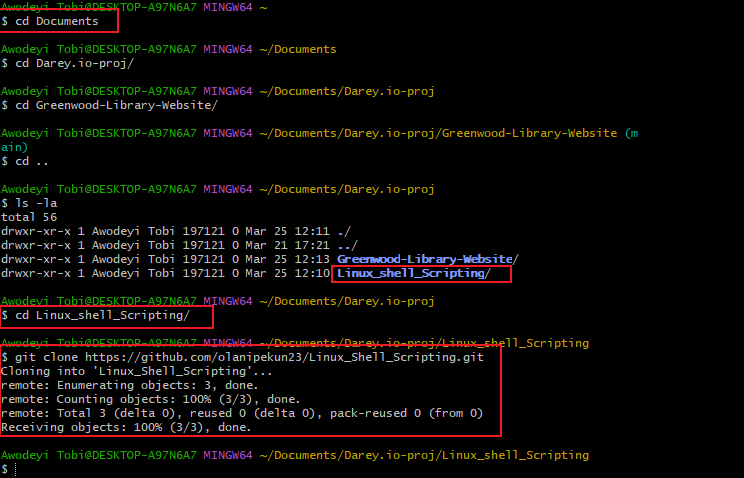

 - 2.2 Clone Git Repository

 Ran a Git clone command on the Directory

 

 - open proj in vscode using ```code .```

 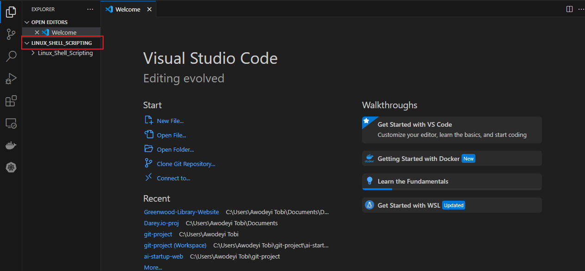

 - 2.3 Creating Img file in vscode

 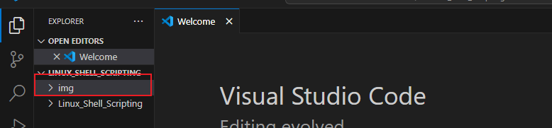

 - 2.4 Creating a Linux_Multiplication_table.sh file using vscode.

 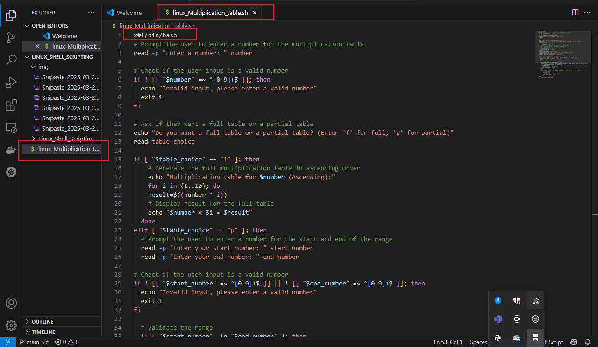

 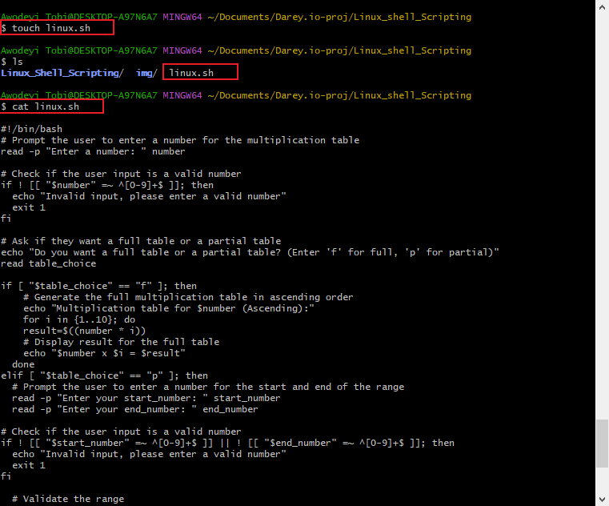

 - 2.5 Making The .sh file Executable using ```chmod```

 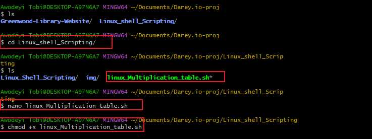

 3. SCRIPT IMPLIMENTATION STEPS

 - 3.1 Prompt for User Imput

 - echo "Enter a number: "

    read number

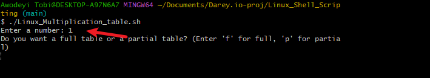

- 3.2 Ask for Table type(full or partial table)

for i in {1..10}

do

echo "$number x $i = $(($number * $i))"

done

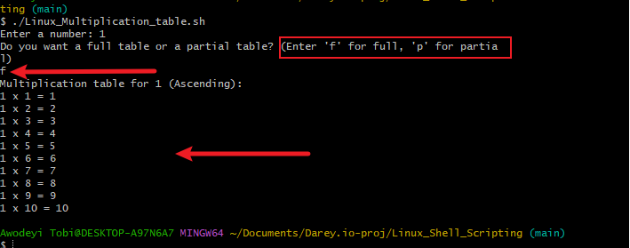

- 3.3 Partial Multiplication Table

echo "Enter start range:"

read start

echo "Enter end range:"

read end

for i in $(seq $start $end)

do

echo "$number x $i = $(($number * $i))"

done

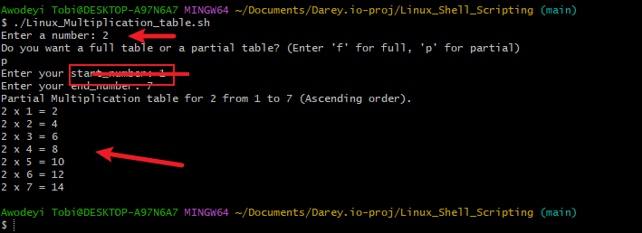

- 3.4 Validate input Range for partial table

if [[ $start -gt $end ]]; then

echo "Invalid range! Start must be less than or

 equal to End."

exit 1

fi

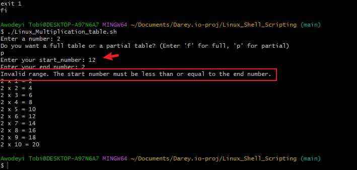

- 3.5 invalid input Handling

if [[ $choice -ne 1 && $choice -ne 2 ]]; then

echo "Invalid choice. Please enter 1 or 2."

exit 1

fi

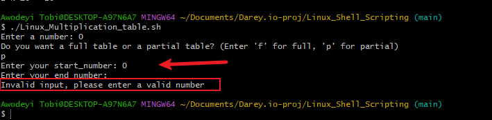

4. TROUBLESHOOTING(9common issues and solution)

- 4.1 Script permmission Denied

issue: Permmission Denied while running script.

solution

"chmod +x Linux_Multiplication_table.sh"

- 4.2 Invalid Inputs

issue: non-numeric value break the script

solution:

Add input validation:

if ! [[ "$number" =~ ^[0-9]+$ ]]; then

echo "Invalid input. Enter a number."

exit 1

fi

## Conclusion

This capstone project demonstrates proficiency in

 Linux shell scripting, Git version control, and 
 
 troubleshooting Bash scripts. By implementing
 
structured Bash scripts with input validation 
  
  and error handling, the project highlights best
  
   practices in automation and scripting for
   
    DevOps.
